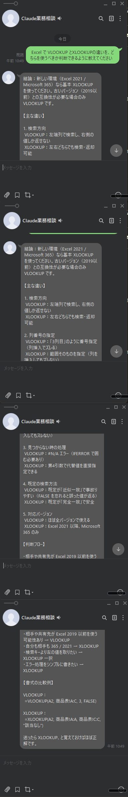
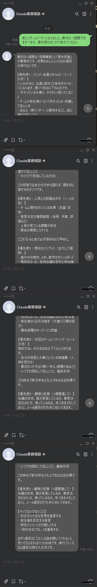
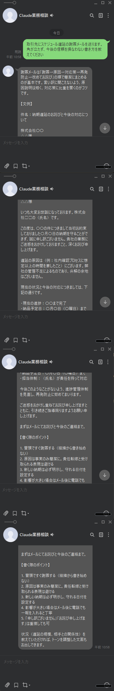
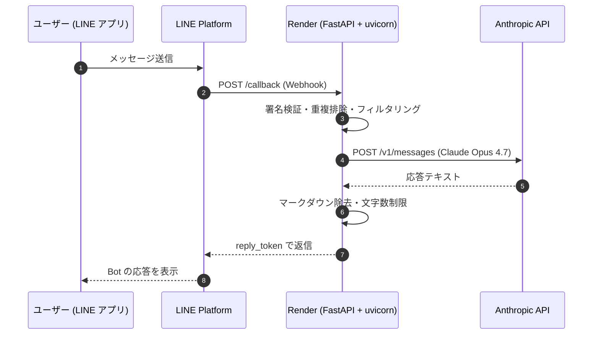

# line-ai-bot

LINE で話しかけるだけで、**Claude Opus 4.7** による業務相談が受けられるチャットボットです。
設計から本番デプロイまで 1 日で完走。外部 AI（Codex）による 3 ラウンドのコードレビューを経て公開しています。


---

## 動いている様子

実際のユーザー（自分）が LINE で送ったメッセージと、Claude Opus の応答です。

<p align="center">
  
  
  
</p>

| 技術相談 | 業務進行の相談 | ビジネス文章の作成 |
|:---:|:---:|:---:|
| Excel 関数の使い分け | 新任リーダーの動き方 | 取引先への謝罪メール |

---

## 試してみる

QR コードから友だち追加 → 何でも送ってみてください。すぐに Claude Opus が応答します。

<p align="center">
  
</p>

> Render Free プランで運用中のため、15 分無アクセスでインスタンスが眠ります。1 通目が応答しない場合は、もう一度送ると起きます。

---

## アーキテクチャ



---

## 技術スタック

| 領域 | 採用技術 | 選定理由 |
|---|---|---|
| 言語 | Python 3.13 | Anthropic SDK と LINE SDK 両方の最新サポート |
| Web フレームワーク | FastAPI + uvicorn | 非同期 I/O とシンプルな Webhook エンドポイント記述 |
| AI | Claude Opus 4.7 | 業務相談の文脈理解と日本語の品質最優先 |
| LINE 連携 | line-bot-sdk-python v3 | 公式 SDK、署名検証を丸ごと任せられる |
| ホスティング | Render（Blueprint 方式） | `render.yaml` コミット → Push で自動デプロイ |
| テスト | pytest | 22 件（ユニット + Webhook シミュレーション） |

---

## 工夫したポイント

### 1. LINE の `reply_token` 1 分制限を守る設計

LINE の仕様で、Webhook 受信から 1 分以内に `reply_token` を使って返信しないと無効化される。一方 Claude Opus の応答は 5〜15 秒かかる場合がある。

- Anthropic SDK の timeout を 30 秒に明示
- SDK のデフォルト `max_retries=2` を `0` に固定（リトライで総時間を超過させない）
- タイムアウトや API 失敗時は**即座にフォールバック文言を返す**（ユーザーを待たせない）

### 2. LINE 向けの出力整形（二層防御）

Claude が `**太字**` や `## 見出し` などのマークダウンで返すと、LINE 上では記号がそのまま表示されて不自然になる。

- **一次防御**: System prompt で明示的に「マークダウン記号を使わず、`【】`・`・`・番号を使うこと」を指示
- **二次防御**: LINE 送信直前に正規表現でマークダウン残存を除去・変換（`app/line_client.py` の `_sanitize_for_line`）
- 5000 文字を超える応答は末尾省略（LINE の TextMessage 上限対応）

### 3. 外部 AI（Codex）による 3 ラウンドのコードレビュー

第三者視点でのレビューを受けるため、別の AI（OpenAI Codex）に設計と実装を渡してレビュー → 反映 → 再レビュー、を収束するまで繰り返した。

- **ラウンド 1**: 計画レビュー（3 指摘反映）
- **ラウンド 2**: 本番前レディネス確認（High 2 / Medium 4 / Low 4、計 10 件反映）
- **ラウンド 3**: 反映確認と残論点（High 1 / Medium 1、計 2 件反映） → Approved / LGTM

往復ログは `portfolio-codex-reviews/` に全文保存。指摘された主なポイント：
- `max_retries=0` 明示による reply_token 対策（ラウンド 3）
- 複数イベント同梱時の処理方針
- Render のプラン選定とコールドスタート対策
- Python バージョン固定

### 4. 重複排除（idempotency）によるメッセージ二重処理の防止

LINE は Webhook の再送を行う場合があるため、同じ `webhookEventId` を短時間に再受信しても二重返信しないよう制御。

- メモリ上の OrderedDict + `threading.Lock` で実装
- TTL 300 秒、最大 10000 件を記憶
- 単一 worker 前提（将来複数台化する場合は Redis 等へ外出しする前提で設計）

### 5. シークレットの徹底管理

公開リポジトリにもかかわらず、鍵・認証情報の漏洩ゼロを徹底：
- `.env` は `.gitignore`
- `.claude/settings.local.json`（開発時の authtoken を含む）も `.gitignore`
- コミット前に鍵パターンを `grep` で全検索する運用
- Render 環境変数は `sync: false` で Blueprint に値を書かない

---

## セットアップ（ローカル開発）

### 前提

- Python 3.13
- Git
- LINE Developers アカウントとチャネル（Messaging API）
- Anthropic API のアカウントとクレジット

### 手順（Windows）

```powershell
git clone https://github.com/makoto-eri/line-ai-bot.git
cd line-ai-bot
python -m venv .venv
.\.venv\Scripts\Activate.ps1
pip install -r requirements.txt
Copy-Item .env.example .env
# .env を編集して各トークンを設定
uvicorn app.main:app --reload
```

### 環境変数

| 変数名 | 必須 | 用途 |
|--------|:---:|------|
| `LINE_CHANNEL_SECRET` | ✓ | Webhook 署名検証 |
| `LINE_CHANNEL_ACCESS_TOKEN` | ✓ | LINE への返信 API 認証 |
| `ANTHROPIC_API_KEY` | ✓ | Claude API 認証 |
| `CLAUDE_MODEL` | - | デフォルト `claude-opus-4-7` |
| `CLAUDE_MAX_TOKENS` | - | デフォルト `1024` |

### ngrok でローカル実機テスト

```bash
# ターミナル 1
uvicorn app.main:app --reload

# ターミナル 2
ngrok http 8000
```

出力された `https://xxxxx.ngrok-free.dev/callback` を LINE Developers Console の Webhook URL に設定し、「検証」ボタンで 200 を確認。

### LINE Developers 側のチェックリスト

- **Webhook の利用**: ON
- **Webhook の再送**: ON
- **応答メッセージ**（LINE Official Account Manager 側）: OFF
- **あいさつメッセージ**: 任意

---

## テスト

```bash
pytest
```

22 件のテストが通過（Webhook 署名検証 / 重複排除 / 再送スキップ / 空メッセージ無視 / 非テキストイベント / Claude 失敗時フォールバック / LINE 返信失敗時 200 継続 / 複数イベント先頭のみ処理 / 5000 文字 truncate / マークダウン除去 / Claude クライアント設定）。

---

## Render デプロイ

`render.yaml` のデフォルトは `plan: free`（疎通確認・ポートフォリオ閲覧用）。

1. GitHub に push
2. Render で `render.yaml` を Blueprint として読み込み Web Service 作成
3. 環境変数 3 つ（`LINE_CHANNEL_SECRET` / `LINE_CHANNEL_ACCESS_TOKEN` / `ANTHROPIC_API_KEY`）を Render ダッシュボードで設定
4. デプロイ後、LINE Webhook URL を `https://<render-url>/callback` に更新

### プラン選定

- **Free プラン**: 15 分無アクセスでスピンダウンし、次回リクエストで約 1 分のコールドスタートが発生。LINE の `reply_token` 1 分制限と競合するため、ポートフォリオ閲覧・デモ用途に限る
- **常時運用する場合は Starter 以上を推奨**（$7/月、常時稼働で reply_token 制限に余裕）

---

## 挙動仕様

- LINE からのリクエストに署名ヘッダー（`X-Line-Signature`）が付いていない、または署名が不正な場合は HTTP `400` を返す
- リクエスト本文が UTF-8 で読めない場合は HTTP `400`
- スタンプや画像などテキスト以外のイベントは無視して HTTP `200`
- 空白のみのメッセージは無視
- 1 つの Webhook リクエストに複数のテキストメッセージが含まれていた場合、**先頭 1 件のみ処理**（`reply_token` 1 分制限を守るため）
- 同じ `webhookEventId` が再送されてきた場合はスキップ（300 秒・最大 10000 件のメモリキャッシュで重複排除）
- LINE が「再送したイベント」と明示してきた場合（`deliveryContext.isRedelivery=true`）は処理しない
- Claude API 呼び出しは 30 秒でタイムアウト。失敗時はフォールバック文言を返す
- Claude の返答が LINE のテキストメッセージ上限（5000 文字）を超えた場合は自動で末尾省略
- LINE 返信 API への送信が失敗しても、Webhook 自体は HTTP `200` を返す（LINE 側の再送ループを避けるため）

---

## 既知の制約 / 今後の改善候補

- 会話履歴は保持しない（1 メッセージ = 1 回の独立した Claude 呼び出し）
- 単一 uvicorn worker 前提。複数台で動かす場合、重複排除メモリを Redis 等の共有ストレージへ
- 応答時間が長引くケースに備えて、将来 `push_message` API（reply_token 不要）へ切り替え検討
- Sentry 等でエラー監視の導入

---

## ディレクトリ構成

```
line-ai-bot/
├── app/
│   ├── main.py            # FastAPI エントリ、Webhook 処理・重複排除
│   ├── config.py          # 環境変数読み込み（pydantic-settings）
│   ├── claude_client.py   # Anthropic SDK ラッパー、system prompt
│   └── line_client.py     # LINE SDK ラッパー、マークダウン除去・truncate
├── tests/
│   └── test_webhook.py    # 22 件のテスト
├── docs/
│   └── screenshots/       # README 用スクリーンショット
├── scripts/
│   └── stitch_screenshots.py  # スクショを縦結合するユーティリティ
├── portfolio-codex-reviews/   # 外部 AI レビューの往復ログ
├── render.yaml                # Render Blueprint
├── Procfile                   # Render / Heroku 互換の起動コマンド
├── requirements.txt
├── .python-version            # 3.13.5 に固定
├── .env.example
└── README.md
```

---

## ライセンス

MIT License

---

## 作者

[@makoto-eri](https://github.com/makoto-eri)

このプロジェクトは個人ポートフォリオ目的で開発したものです。設計判断やレビュー履歴は `portfolio-codex-reviews/` に全文残しています。
